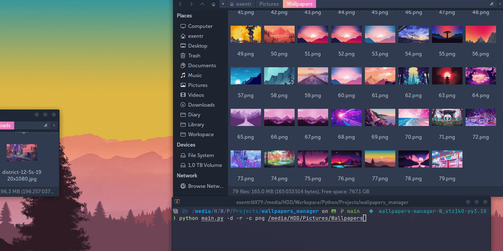

# Wallpapers manager
Simple tool for renaming and converting wallpapers named numerically

## Usage
```
wallp [-h] [-c {png,jpg,jpeg}] [-r] [-b [DEST]] [-d] path

positional arguments:
  path                  Path with all wallpapers

options:
  -h, --help            show this help message and exit
  -c {png,jpg,jpeg}, --convert {png,jpg,jpeg}
                        Convert all files to specific format
  -r, --rename          Rename all files in a directory numerically
  -b [DEST], --backup [DEST]
                        Make a ZIP archive with all wallpapers
  -d, --dispatch        Watch directory for changes
```
## Dispatched mode demo
